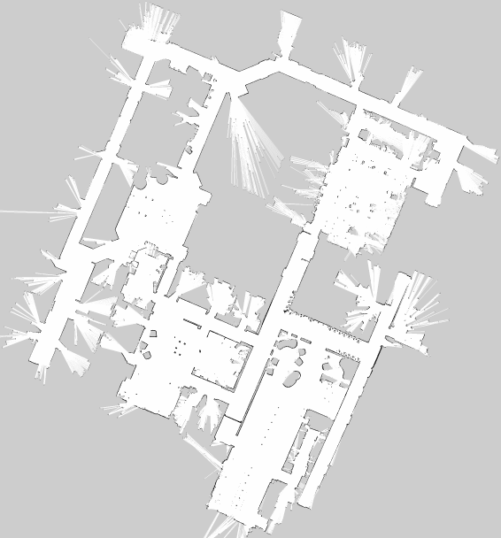
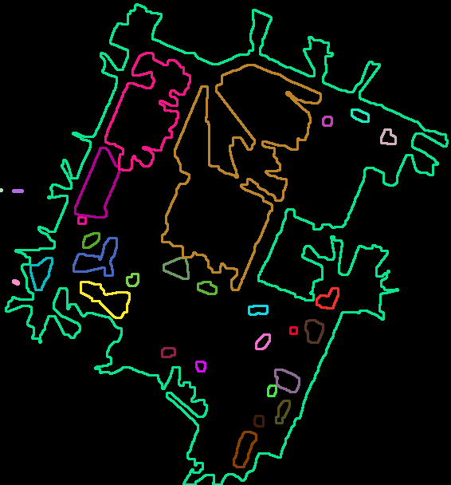
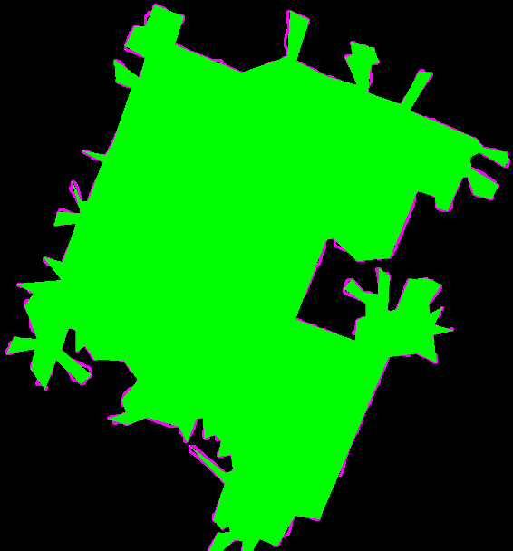
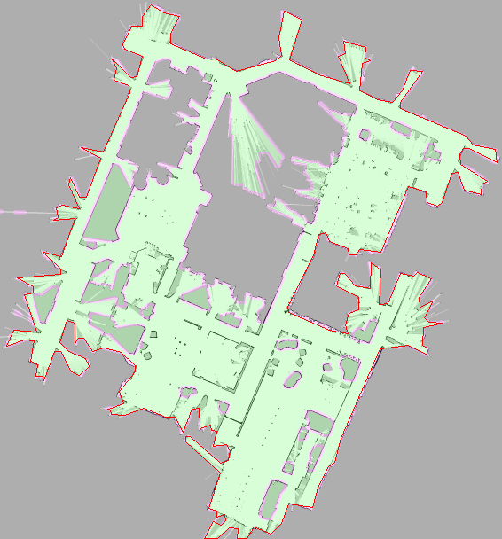

# A Map Processing package for ROS

## Description
This is a ROS package for map processing. It is used to process the map image file or ROS map topic.

The package currently includes:
- [space volume calculator] (src/calculate_space.cpp): calculate the space volume by extract the acceptable area in the map

The pipelines of each part above will be introduced in the following.

## Details

### Space volume calculator
- **Aim**

To calculate the area and volume by segmenting the map generated by SLAM.

- **Pipelines**
  - **Input map**

    

  - **Median blur**

    Use `cv::medianBlur` to smooth the image, remove small holes and measurement errors.

    

  - **Threshold**

    Use `cv::inRange` to keep freespace and obstacles.

    

  - **Morphology operation: open**

    Use `cv::morphologyEx` with `cv::MORPH_OPEN` to ignore seperated freespace.

    

  - **Morphology operation: close**

    Use `cv::morphologyEx` with `cv::MORPH_CLOSE` to fill holes.

    

  - **Find contour**

    Use `cv::findContours` with `cv::RETR_TREE` to find all contours. Then traverse all the contours to find the largest one by `cv::contourArea`.

    

  - **Decide possible freespace**

    Use `cv::approxPolyDP` to fit the largest contour. Then generate the space by `cv::fillPoly`.

    

  - **Exclude non-accessible area**

    Use `cv::drawContours` to fill those contours larger than the `INNER_AREA_THRESH`.

    

  - **Calculate area and volume**

    Traverse the freespace image to count the green pixels. Then calculate the space area and volume with the given `RESOLUTION` of the map and the argument `floor_height`.

  - **Show merged results**

    Use `cv::addWeighted` to add freespace image to the map.

    
